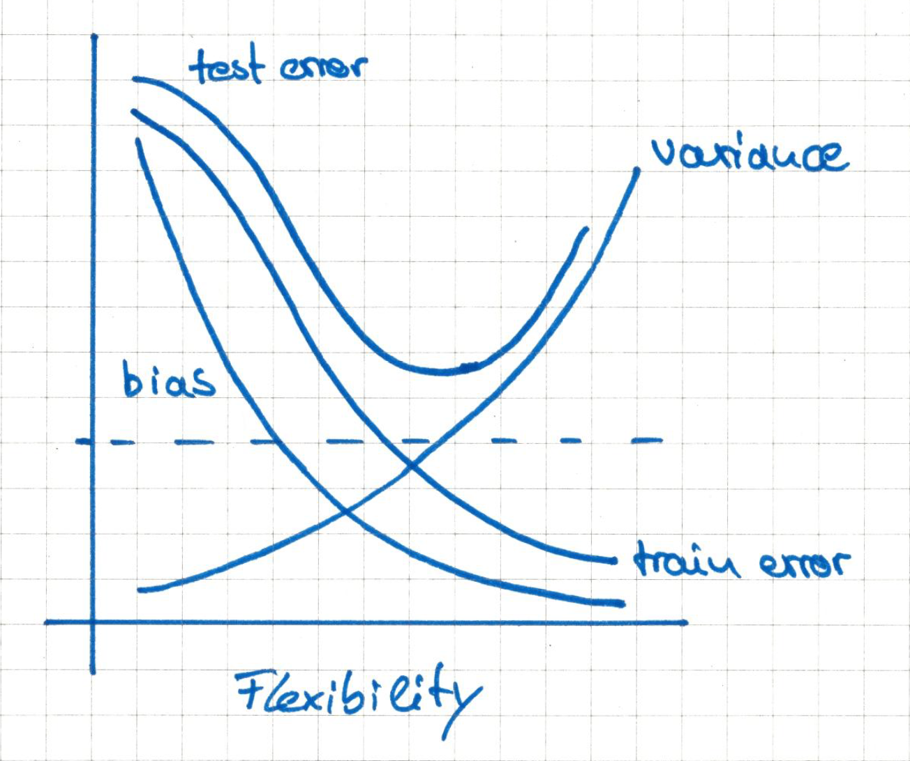

```{r setup}
knitr::opts_chunk$set(
  collapse = TRUE,
  comment = "#>"
)

library(MASS)
library(tidyverse)
library(magrittr)
library(ISLR)
library(skimr)
library(GGally)
library(cowplot)

theme_set(theme_minimal())
```

# Conceptual

(@)
(a) Flexible methods should outperform inflexible methods because the large sample size prevents flexible methods from overfitting.
(b) When dealing with small samples and many predictors, flexible methods tend to overfit because they show higher variances. Therefore one should expect less flexible methods to perform better.
(c) Flexible methods will outperform inflexible methods since they are generally less biased, especially if the true relationship between predictors and response is non-linear.
(d) One might expect less flexible methods to perform better in this setting since they do not catch every bit of variance in the data and therefore provide more smoothing. Flexible methods on the other hand are likely to overfit.
    
(@)
(a) regression problem; inference; n = 500; p = 3
(b) classification problem; prediction; n = 20; p = 13
(c) regression problem; prediction; n = 52; p = 3

(@)
(a) 

(b) The _bias curve_ decreases monotonically since more flexible methods capture more of the variation in the data, resulting in lower bias. The _variance_ curve increases monotonically because higher flexibility allows to reflect smaller details in the data. This results in higher variance. The _training error_ decreases monotonically because more flexible methods can ultimately catch up every variation in the data, including white noise. Therefore the training error can be reduced to zero. The _test error_ curve follows a U-shape. In the beginning, more flexibility leads to lower bias and therefore lower test errors. With increasing flexibility, methods begin to overfit the data by capturing white noise. The _Bayes error_ curve is a horizontal line because

(@) To be added

(@) A very flexible approach is able to take into account very small bits of variation in the data. This makes flexible approaches prone to overfitting. If the true relation of of response and predictors is non-linear, more flexible approaches have advantages because they can reflect the non-linear relation better. Also, if prediction accuracy is more important than interpretability of a model, more flexible approaches might be better. Less flexible approaches have advantages when it comes to interpretability of results rather than prediction accuracy.

(@) A parametric approach assumes a specific relation between response and predictors. This is good, when the true relationship is similar to the assumed one because fitting parametric models is easy in comparison to fitting non-parametric models. This is bad, if the assumed relationship is very different from the true relationship, resulting in a poor fit.

(@) 
(a) 
```{r}
table <- 
  tibble(obs = 1:6,
         X_1 = c(0, 2, 0, 0,-1, 1),
         X_2 = c(3, 0, 1, 1, 0, 1),
         X_3 = c(0, 0, 3, 2, 1, 1),
         Y = c("Red", "Red", "Red", "Green", "Green", "Red")) %>% 
  mutate(eucl_dist = sqrt((X_1 - 0)^2 + (X_2 - 0)^2 + (X_3 - 0)^2))

table
```

(b) 
```{r}
table %>% 
  arrange(eucl_dist) 
```
My prediction is "Green" because obs 5 shows the lowest euclidian distance and Y(obs = 5) = "Green".

(c) My prediction is "Red" because 2 out of those 3 obs with lowest euclidian distance have Y = "Red".

(d) We would expect that the best value of _K_ is rather low, because this allows for more variance in the predictions.

# Applied
(@)
(a)
```{r}
College <- as_tibble(College)
```
(b)
```{r}
College %>%
  rownames_to_column(var = "University")
```

(c)

i.
```{r}
summary(College)

skim(College)
```

ii.
```{r}
pairs(College[, 1:5])

ggpairs(College[, 1:5],
        aes(color = Private)) %>% 
  print(progress = FALSE)
```

iii.
```{r}
ggplot(College, aes(x = Private, y = Outstate)) + 
  geom_boxplot()
```

iv.
```{r}
College %<>% 
  mutate(Elite = if_else(Top10perc > 50,
                         "Yes", "No") %>% 
           factor())

College %>% 
  count(Elite)

ggplot(College, aes(x = Elite, y = Outstate)) + 
  geom_boxplot()
```

v.
```{r}
bins <- c(5, 10, 20, 40)
flex_hist <- function(var, bins, df) {
  var <- rlang::sym(var)
  map(bins, 
      ~ ggplot(df, aes_((var))) +
        geom_histogram(bins = .x) +
        labs(subtitle = str_c("bins = ", .x)))
}

plots <- map(c("Apps", "Accept", "Enroll", "Grad.Rate"),
             flex_hist, bins = bins, df = College) 

map(plots, 
    ~ plot_grid(plotlist = .x, ncol = 2))
```

vi. To be amended

(@) 
```{r}
Auto <- as_tibble(Auto)

Auto %>% filter_all(any_vars(is.na(.)))
```
No `NA`s in the data.

a.
```{r}
glimpse(Auto)
```

`origin` is the only qualitative predictor. `name` is rather a row id, all other variables are quantitative.

```{r}
Auto %<>%
  mutate(origin = factor(origin, 
                         levels = 1:3,
                         labels = c("American", "European", "Japanese")))
```

b. see (c)

c. 
```{r}
lower.boundary <- function(x) {range(x, na.rm = TRUE)[1]}
upper.boundary <- function(x) {range(x, na.rm = TRUE)[2]}

Auto %>% 
  summarise_if(is.numeric,
               funs("mean", "sd", "lower.boundary", "upper.boundary")) %>% 
  gather() %>% 
  separate(key, into = c("variable", "measure"), sep = "_") %>% 
  spread(measure, value) %>% 
  dplyr::select(variable, ends_with("boundary"), everything())
```

d.
```{r}
Auto %>% 
  slice(-(10:85)) %>% 
  summarise_if(is.numeric,
               funs("mean", "sd", "lower.boundary", "upper.boundary")) %>% 
  gather() %>% 
  separate(key, into = c("variable", "measure"), sep = "_") %>% 
  spread(measure, value) %>% 
  dplyr::select(variable, ends_with("boundary"), everything())
```

e.
```{r, fig.height = 8}
Auto %>% 
  dplyr::select(-year, -name) %>% 
  ggpairs(aes(color = origin)) %>% 
  print(progress = FALSE)
```

f. `cylinders`, `displacement`, `horsepower` and `weight` show a strong negative correlation with `mpg` so these should be included in the model.

(@)
a.
```{r}
Boston <- as_tibble(Boston) %>% 
  mutate(chas = factor(chas, levels = 0:1, labels = c("otherwise", "river bound")))
dim(Boston)
```

Rows represent suburbs, columns represent characteristics of these suburbs.

b.
```{r, fig.height = 8}
Boston %>% 
  ggpairs() %>% 
  print(progress = FALSE)
```

c. Basically all predictors are associated with `crim`, but not in a linear way. Hence, the correlations are rather low.

d.
```{r}
Boston %>% 
  top_n(n = 10, wt = crim)

map2(rlang::quos(crim, tax, ptratio), c(5, 5, 1),
    ~ ggplot(Boston, aes_(.x)) +
      geom_histogram(binwidth = .y)) %>% 
  plot_grid(plotlist = .)
```

e. 
```{r}
Boston %>% 
  count(chas)
```

f.
```{r}
Boston %>% 
  summarise(median(ptratio))
```

g.
```{r}
Boston %>% 
  mutate(low_medv = if_else(medv == min(medv), TRUE, FALSE)) %>% 
  group_by(low_medv) %>% 
  summarise_if(is.numeric, mean)
```

h.
```{r}
map_df(list("rm > 7" = 7, "rm > 8" = 8), 
       ~ Boston %>% 
         filter(rm > .x) %>% 
         nrow())

Boston %>% 
  group_by(rm > 8) %>% 
  summarise_if(is.numeric, mean)
```
